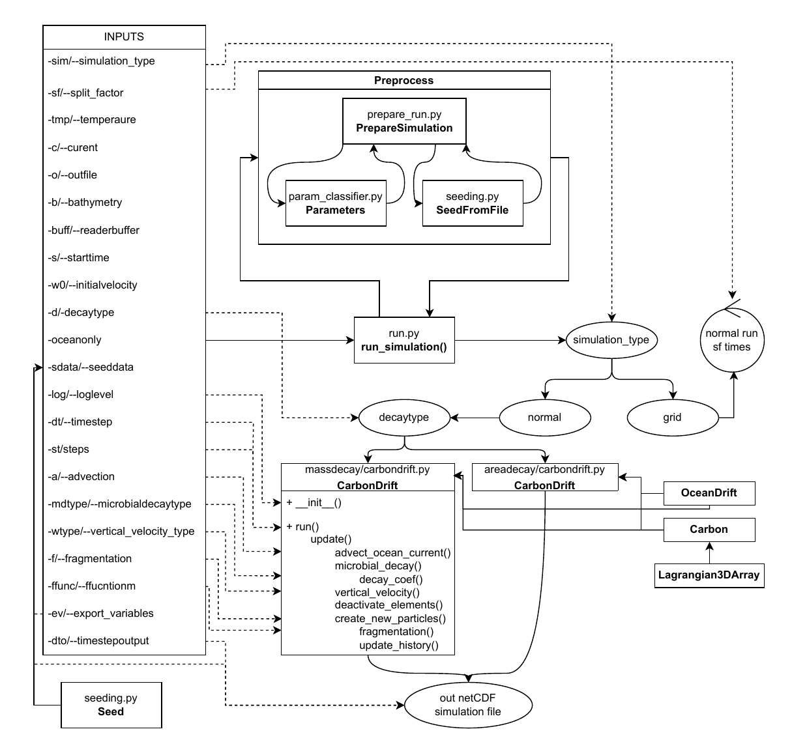

# CarbonDrift
Lagrangian 3d tracking of Gelatinous Zooplankton particles.

## Short description
CarbonDrift is an extension of the OceanDrift module in the opendrift python environment [(Dagestad et al., 2018)](https://www.researchgate.net/publication/324506124_OpenDrift_v10_a_generic_framework_for_trajectory_modelling). It models Gelatinous Zooplankton (GZ) vertical sinking using Decay Rate to Temperature dependenices from [Lebrato et al., (2019)](https://doi.org/10.1029/2019GB006265), while also allowing for horizontal advection modeling. It can be easily run from a terminal with numerous parameters for simulation and plotting preferences. For more specific uses, however, it can be imported as a library into a user-custom python script. Simulation models include the ***mass decay*** from [Lebrato et al., (2011)](https://aslopubs.onlinelibrary.wiley.com/doi/10.4319/lo.2011.56.5.1917):
$$
\frac{dm}{dt} = -k(T(z(t)))m,
$$
where $m$ is the mass and $k(T)$ is the first order decay rate function of temperature $T$ in degrees celsius. Futhermore, there is a second decay model known as ***area decay***, in which the mass rate is proportional to its area $S$ (*not yet published*):
$$
\frac{dm}{dt} = -k(T(z(t)))S.
$$
Both models can be run with a constant sinking speed $w_0$ or with a variabe sinking speed (not yet published)
$$
w(t) = w_0 \sqrt[6]{\frac{m(t)}{m_0}},
$$
where the subscript 0 denotes initial values.

In the horizontal directions, advection is allowed if the currents are provided.

Numerous visualization methods are provided, including mass fluxes on the world map, speciffic property dependencies (e.g. mass vs depth), flux distributions, sinking animations and others.

## Download
**Required packages**

To run CarbonDrift the following packages shold be installed:
1. opendrift
2. numba
3. Haversine (only for current strength plotting)

Then one can simply clone the github repository to their local computer, navigate to the CarbonDrift directory and run the command

```console
~/CarbonDrift$ pip install -e .
```
## Run a simulation
### Standard opendrift simulation
For very specific simulations the CarbonDrift modules can be run like any other opendrift submodule. The user should create their own script and follow these steps
1. Import CarbonDrift from either model.massdecay or model.areadecaay.
2. Possibly import other libraries like numpy, datetime, opendrift.readers etc.
3. Create a CarbonDrift object instance.
4. Add readers, configures etc. 
5. Seed elements at desired locations, depths, with appropriate masses etc.
6. Run and save the simulation by calling the run() method.

An example is shown in [examples/custom_simulation_run.py](examples/custom_simulation_run.py)

### Automized method
CarbonDrift also allows running and later plotting simulations straight from a terminal. The diagram bellow higlights how this is achieved.



First we must seed data to a pickle file, by running for example the following script:

```python
from simulation.seeding import Seed
S = Seed("rectangle", bathymetrypath="./supplemetary_data/etopo2.nc",
        outfile = <outfile.pkl path>, phylum = <phylum , e.g "chordata">,
        initialmassdata="./supplementary_data/Luo_M_Eg_biome_data.json",
        biomegridpath="./supplementary_data/biomegrid.2npy", poctype = <POC TYPE: "M" OR "Eg">,
        constantdensity=True)
```

This calls the Seed class, which will save initial conditions used by [Luo et al, (2020)](https://agupubs.onlinelibrary.wiley.com/doi/full/10.1029/2020GB006704) to a pickle outfile.

Of course one can create their own pickle datafile, but the dataframe should contain the following keys: "lon", "lat", "mass", "z", while the values should be equal length numpy arrays or scalars (just as for normal opendrift simulations).

To run a CarbonDrift simulation from the terminal one can now simply run the following comand in the root directory

```console
~/CarbonDrift$ python -m simulation.run -tmp <temperature netcdf filepath> -b <bathimetry netcdf filepath> -sdata <seed.pkl filepath> -s <starttime> -o <out netcdf filepath> -st <simulation steps>
```

For further information on other arguments use header in terminal or check the diagram above.

**Note:** To avoid long terminal inputs, one can save parameters to a parameters.txt file of format

```
-tmp
<temperatuure netcdf filepath>
-b
<bathimetry netcdf filepath>
-sdata
<seed.pkl filepath>
-s
2010-01-01-0
--steps
420
```

The simulation can then be run as:

```console
~/CarbonDrift$ python -m simulation.run @/path_to_parameter_file/parameters.txt -o <out netcdf filepath> 
```
An example of the parameter file and the bash script can be found in [examples/terminal_simulation_run.sh](examples/terminal_simulation_run.sh).

### Fragmentation
Fragmentation can be activated by adding the following line to your parameter file
```
--fragmentation
```
or just
```
-f
```
for short. Next the user should also **specify the fragmentation condition** in form of a python code. The variable should be a **boolean numpy array**. The CD **variables must be enclosed in semicolumns.** For example:

```
-ffunc
np.logical__and(;m;>0.1, np.sqrt(;m; / ;m0;) * 0.2 > np.random.random(len(;m0;)))
```

The example above will first check if the mass is greater than 0.1 and then proceed to see, if its relative value is greater than some sampled random number. If both conditions are True, the particle will split into two particles, with masses sampled from a uniform distribution, where the total mass is preserved. The command line run method currently allows the use of the following variables:
- **T** for sea water temperature
- **m** for particle mass
- **m0** for initial particle mass
- **u** for x sea water velocity
- **v** for y sea water velocity
- **uh** for horizontal sea water velocity $\sqrt{u^2 + v^2}$
- **z** for particle depth

**Note:** The run time of a simulation can be significantly increased with fragmentation. Furthermore the ***memory usage*** can be ***substantial***, thus it is advised to run these simulations in ***grid mode*** by specifying

```
-sim
grid
-sf
3
```
where sf is the ***split factor*** parameter, which splits the simulation into given number of simulations (i.e. in this case 3 sub-simulations).

**Note:** If the user is running the simulation without the command line run method, (i.e. in a seperate python script), the fragmentatiuon function should be ***added*** to the new ***CarbonDrift initialization object*** as a ***callable***, which excepts ***three arguments***: elements, environment and m0. For example the above example would look like
```python
frag_func = lambda elements, environment, m0: np.logical_and(np.sqrt(elements.mass / m0) > np.random.random(len(m0)), elements.mass > 0.1)

o = CarbonDrift(ffunction = frag_func)
```  
Note that this requires some knowledge of opendrift, as the correct variables have to be chosen from the correct recarrays. For example the temperature would be accessed with environment.sea_water_temperature.

### Important simulation notes

1. The updated ***fragmentation*** option for GZ has ***not been substantialy tested so far (especially in plotting)***, thus use it with caution.
2. The updated ***GridRun*** option for running massive simulations has ***not been substantialy tested so far***, thus use it with caution. However, for simulations without fragmentation, most computers should have no problem running the simualtions in normal mode. Simulations on 1 degree grid cells (number of particles of order $\gtrsim 10^4$) have not shown any memory problems, even with added horizontal advection.
3. The ***DivideAndConquer*** scheme for massive simulations has been ***deprecated***, as it bears no benefit to the GridRun module.
4. ***Horizontal Advection*** considerably increases simulation time.
5. To ***reduce the output file size***, paramters -ev and -dto should be adjusted appropriately. The first specifies the epxort variables in the run() method in OceanDrift (for more info reffer to the main() function in [simulation.run](./simulation/run.py#main), while the latter speecifies the output time step.

## Plotting a simulation

CarbonDrift provides many built in plotting methods in the model.plots submodule. To run any one of these methods open the terminal in the root directory and type

```console
~/CarbonDrift$ python -m plotting.plot_run <plot method, e.g mass_map> <file1path> <file2path (not necessary)> -o <outfile.pdf filepath>>
```
**NOTE:** The number of filepaths is unlimited.

Similarly one can save certain/all parameters to a .txt file and in a terminal simply run the command

```console
~/CarbonDrift$ python -m plotting.plot_run @/path_to_parameters/parameters.txt
```
### Plotting examples
In this section we will show some plotting methods and their outputs.
1. **Plot locations of specific drifters**

Save the following parameters to a .txt file:

```
drifter_locations
<simualtion filepath>
-fs
20:10
-loc
m48:30,m2:75,1:38
-legend
Mid Atlantic,Arctic,Western Mediterranean
-color
blue,black,red
-xlim
m60:15
-ylim
15:90
-fts
22
-dpi
600
-o
./examples/images/locations.png
```

Next run the following command in the terminal

```console
~/CarbonDrift$ python -m plotting.plot_run @location_params.txt
```
This will result in the following output:


2. **Plot some drifter properties**

To make a 2D plot of some property vs another property for N different simulations the parameter file should contain the following arguments:

```
drifter_properties
<file1 path>
<file2 path>
<file3 path>
<file4 path>
-fs
20:10
-loc
m48:30,m2:75,1:38
-p1
mass
-p2
z
-lines
-t
LIN_decay,_z0_=_-100_m,_w0_=_500_m/d
-xlabel
$m/m_0$
-ylabel
$z\,\mathrm{[m]}$
-lw
3
-xlim
0:1
-ylim
m2500:0
-legend
EXP $\frac{dm}{dt} = -km$,LIN $\frac{dm}{dt} = -km$,EXP $\frac{dm}{dt} = -kS$,LIN $\frac{dm}{dt} = -kS$
-color
royalblue,blue,darkorange,orange
-ls
solid,dashed,solid,dashed
-mc
0.86
-supt
Mid Atlantic,Arctic,Western Mediterranean
-fts
21
-dpi
600
-o
./examples/images/z_mass.png
```

The output should look something like this:


Here we have added the Martin Curve [Martin et al., (1987)](https://www.sciencedirect.com/science/article/abs/pii/0198014987900860)
$$
\frac{\mathrm{flux}}{\text{flux at ref point } z_0} = \left(\frac{z}{z_0}\right)^b,
$$
where the standard value for the parameter $b = 0.86$ was used.
To plot other properties one can choose between

```python
["time", "mass", "z", "sea_water_temperature", "x_sea_water_velocity", "y_sea_water_velocity"]
```

**NOTE:** If one property is mass and the -abs argument is not set, the plot will show mass fraction.

3. **Cartopy map of mass flux at given depth**

To plot the mass of each grid cell at a given depth the following parameters may be provided:

```
mass_flux_map
<file1 path>
<file2 path>
...
<fileN path>
-fs
12:8
-cblabel
$\text{carbon flux at 100 m } \mathrm{[g\,C\,m^{-2}\,Y^{-1}]}$
-t
EXP_decay,constant_speed
-d
-100
-cmap
tab20b
--shrink
0.8
-add
-clip
0:20
-fts
25
-o
./examples/images/mass_map.png
```

**NOTE:** We used the -add argument to ***add N files*** together at each grid cell.

**NOTE:** If one would like to ***plot the difference*** between ***two simulations***, two filepaths should be provided in the parameters, together with the -diff argument. One can then impose the -abs argument to plot the ***absolute difference*** file1 - file2. If -abs is not added, the plotted result will be (file1 - file2) / file1.

**NOTE:** If one would like to ***plot a sum and difference of multiple files***, the files should be added in the following order:
1. First $k$ files that will have a positive sign in the summation.
2. Next $l$ files that will have a negative sign in the summation.

Next add the -diffidx parameter to specify, where the minus sign is given (e.g. in this example diffidx = $k$). If the diffidx is not provided it is assumed, that $\text{diffidx} = (k+l) // 2$.

**NOTE:** In general (except when only -add is given) the -abs argument should be provided, in order to plot the ***current mass***, otherwise the ***mass fraction*** $\frac{m}{m_0}(\varphi, \lambda)$ will be plotted for each grid cell.

**NOTE:** If the depth argument -d is set to less than -5000, depth will be set to **seafloor**.

A possible output will look something like:


4. **Total mass at depth**

To calculate the mass sum of all grid cells at a given depth, one can run the simulation with parameters

```
get_mass_sum_at_depth
<file1 path>
-d
-100
-abs
```

To get biome specific masses the method *get_mass_sum_at_depth* should be replaced by *get_biome_weighted_mass_at_depth* in the parameter.txt file.

5. **Current strength**

To plot the distance traveled by each drifter until it reaches a given depth in kilometers the following parameters may be provided:

```
current_strength
<file1 path>
-fs
12:8
-d
-1000
--shrink
0.8
-cmap
Blues
-cblabel
$|\vec{r}_H(z=-1000\,\mathrm{m}) - \vec{r}_{H0}|$ [km]
-t
w0_=_1000_m/d
-clip
0:40
-fts
30
-o
./examples/images/current.png
```

**NOTE:** If a drifter had not yet passed the specified depth and was active at the end of the simulation, a ***warning will be raised*** and the absolute distance between the first and last points will be shown.  

A possible output will look something like:


6. **Sinking animation**

To save a 3D animation of a simulation one should provide the following parameters to the .txt file:

```
animate_3D
<file1 path>
-fs
12:8
--shrink
0.6
-o
./examples/images/cnidaria_M_animation.gif
```


### Important plotting notes
1. The first argument should always be the method name.
2. Next arguments should be the file paths.
3. Only then can other keyword arguments be added. 
4. In general the ***relative values*** for mass and mass flux are assumed. If the user wishes to plot the ***absolute values*** the -abs argument should be given. The only exception, where this is not required, are mass_map and mass_flux_map methods, provided that -add is set to True and -diff is set to False.
5. When using -clip to clip array values use m for negative values, e.g. m4:5.
6. For further inquiry on plotting parameters, the user is advised to check the header info in the terminal
```console
~/CarbonDrift$ python -m plotting.plot_run -h
```
Alternatively one can check the specific plotting methods and their parameters by going through the code in [model.plots](/model/plots.py)


**WORK IN PROGRESS**
